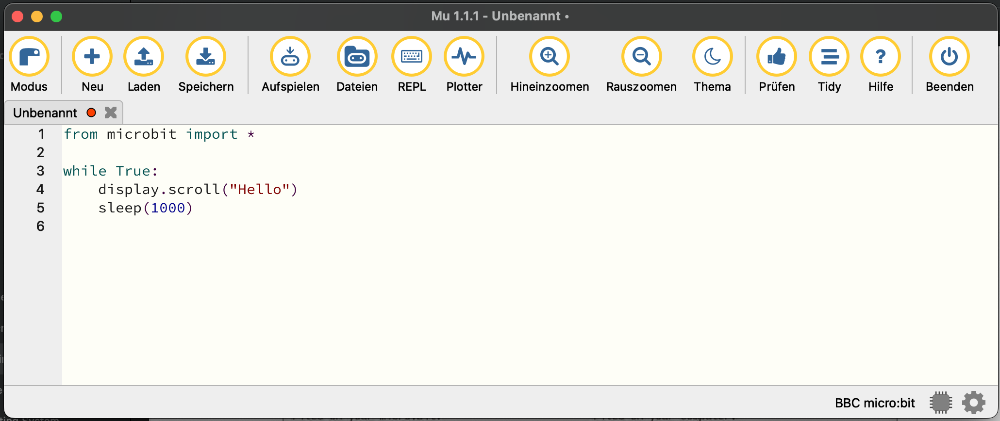

# Projekt Micro:bit

Der [BBC Micro:bit](https://microbit.org) ist ein kleines embedded Device mit einem ARM M-Core und einigen Sensoren, Tastern und LEDs. Die Zielgruppe des Mirco:bit sind Schüler.

Die Skripte in diesem Repository sind Inspiriert durch "Make: Getting Started with the micro:bit" von Wolfram Donat.

## Programmieren mit MicroPython

Auf der Micro:bit Seite wird ein [Online Editor](https://python.microbit.org/v/3) angeboten. Diese ist die einfachste Möglichkeit um mit dem Programmieren zu starten, und eine MicroPython hex-Datei für den Micro:bit zu bekommen.

Wenn der Micro:bit mit dem Rechner verbunden ist erscheint er als externen Laufwerk. Die hex-Datei die mit dem Online-Editor erzeugt wurde kann auf den Microbit übertragen werden indem sie auf dieses Laufwerk kopiert wird.

### Mu IDE einrichten

Der Online-Editor ist für erste Versuche geeignet, um echte Projekte umzusetzen eignet sich eine lokale "Integrierte Entwicklungsumgebung" (Integrated Development Environment, IDE) besser. Für diese Beschreibung verwende ich [mu](https://codewith.mu). Mu ist eine sehr einfache IDE für MicroPython.

### Mu IDE testen

Stelle sicher dass dein Micro:bit mit deinem Rechner verbunden ist und das externe Laufwerk "MICROBIT" angezeigt wird. Starte dann Mu im Micro:bit Modus.

Das erste Program mit Mu, zum testen ob die Integration funktioniert ist:

```python
from microbit import *

while True:
    display.scroll('Hello')
    sleep(1000)
```

Gib dieses Program in Mu ein und drück den Knopf "Aufspielen". 



Nach ein paar Sekunden erscheint auf dem LED-Display des Mirco:bit der Text "Hello", gefolgt von einer kurzen Pause.

## Mini-Projekte

Nachdem Mu eingerichtet ist können wir mit ersten Mini-Projekten starten um die verfügbaren Sensoren, Taster und Ausgabe-Optionen kennenzulernen.

Die [API Referenz](https://python.microbit.org/v/3/reference) (Application Programming Interface, API) findest du integriert im Micro:bit Python Online Editor.

### Dot-Matrix-Display

Die Mirco:bit API stellt ein "display" Objekt bereit, mit dem auf einfach Texte und vordefinierte Bilder auf dem Dot-Matrix-Display angezeigt werden können.

Bilder können über Konstanten ausgewählt werden. Ein Herz kann z.B. mit dem folgenden Skript angezeigt werden:

```python
from microbit import *

display.show(Image.HEART)
sleep(1000)
```
Die Liste mit allen vordefinierten Bildern findet sich in der [API](https://python.microbit.org/v/3/api/microbit.Image). Das folgende Skript zeigt im Wechsel das große und kleine Herz dar:

```python
from microbit import *

while True:
    display.show(Image.HEART)
    sleep(1000)
    display.show(Image.HEART_SMALL)
    sleep(1000)
```


